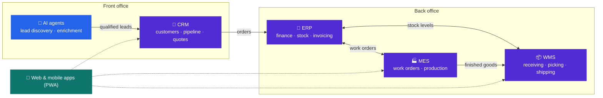

 

## About me

I design and build business software end to end, from the database and APIs to the web and
mobile screens people use every day. My work sits where sales, production and warehouse
operations meet: **CRM, ERP, MES and WMS** systems, the integrations that keep them in sync,
and **AI-powered tools** that take repetitive work off people's plates.

## What I build

<table>
  <tr>
    <td width="33%" valign="top">
      <h3>🤝 CRM</h3>
      Customer 360, sales pipeline, quotes and dealer networks, with role- and data-based
      access control and a complete audit trail.
    </td>
    <td width="33%" valign="top">
      <h3>🏭 MES</h3>
      Work orders, shop-floor data capture and real-time production tracking and reporting.
    </td>
    <td width="33%" valign="top">
      <h3>📦 WMS</h3>
      Receiving, put-away, picking and shipping, driven by barcode-based mobile workflows.
    </td>
  </tr>
  <tr>
    <td width="33%" valign="top">
      <h3>🔗 ERP integrations</h3>
      Reliable two-way sync of customers, products, orders and invoices, including
      multi-company setups.
    </td>
    <td width="33%" valign="top">
      <h3>🤖 AI &amp; automation</h3>
      LLM-powered assistants and AI agents that automate sales and back-office workflows.
    </td>
    <td width="33%" valign="top">
      <h3>🎯 Customer discovery</h3>
      Lead generation pipelines that find potential customers, enrich company data and
      score leads for the sales team.
    </td>
  </tr>
  <tr>
    <td colspan="3" valign="top">
      <h3>💬 Real-time collaboration</h3>
      Live messaging, notifications and video meetings built into business apps, on the web
      and on mobile as installable PWAs.
    </td>
  </tr>
</table>

## How the pieces fit together

## Tech stack

  

  
  
  

| Area | Technologies |
|---|---|
| **Backend** | C# · .NET · ASP.NET Core · Entity Framework Core · SignalR · REST APIs |
| **Database** | SQL Server · T-SQL · data modeling |
| **Frontend** | TypeScript · React · Next.js · Tailwind CSS · PWA |
| **AI** | LLM integrations · AI agents · prompt engineering · data enrichment |
| **Quality & DevOps** | xUnit · Playwright · Vitest · GitHub Actions · IIS |

## Engineering principles

- **Secure by default:** authentication, authorization, encryption and audit trails from day one
- **Fast:** screens and actions designed to respond in under a second
- **Tested:** unit, integration and end-to-end tests on every change
- **Global-ready:** multi-language interfaces and accessibility built in

### Let's connect

